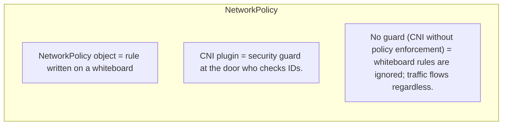
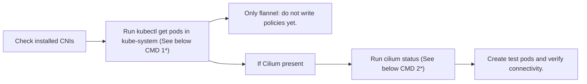
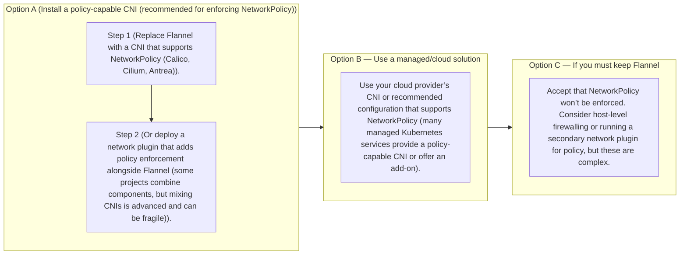
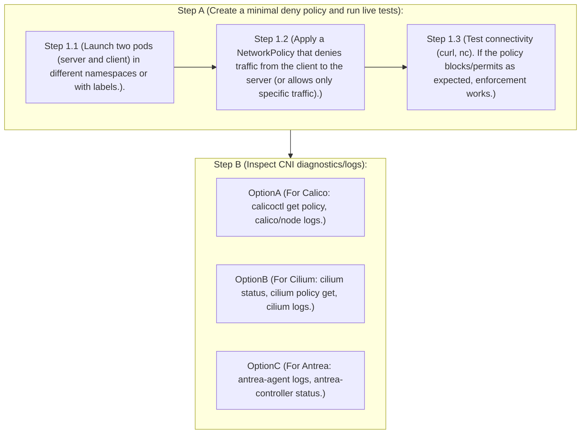

# Project Title
### Zero-Trust Pod Networking: Default-Deny Microsegmentation with NetworkPolicy and AdminNetworkPolicy


## Tool versions: 
  - Kubernetes 1.36 (networking.k8s.io/v1 NetworkPolicy — stable, unchanged surface since 1.7), 
  - CNI: Cilium v1.19.5 or Calico v3.31.x (examples given for both — pick whichever matches your cluster), 
  - AdminNetworkPolicy / BaselineAdminNetworkPolicy CRDs (sig-network-policy-api, currently v1alpha1/beta, install via 
  - network-policy-api release manifests)

## What You Will Build
```markdown
  • A default-deny baseline for team-alpha and team-beta that closes all traffic by default — the single highest-leverage security control in this entire tutorial series
  • Least-privilege ingress/egress rules for the myapp FastAPI service from T-05, allowing only the traffic it actually needs
  • A working, correctly-scoped DNS egress rule — the #1 thing that breaks in real clusters the first time someone applies 
    default-deny
  • A cluster-wide AdminNetworkPolicy and BaselineAdminNetworkPolicy pair, showing the difference between "cannot be 
    overridden" and "can be overridden by namespace owners" — a distinction that didn't exist in plain NetworkPolicy at all
  • A verification workflow using a throwaway debug pod to prove policies work, not just assume they do
```

## What is NetworkPolicy
    • Kubernetes NetworkPolicy objects are declarative requests stored by the API server. They describe desired network  
      access rules between pods, namespaces, and IP blocks.

    • Kubernetes does not implement or enforce those rules itself. Enforcement is performed by the cluster's CNI plugin (the 
      networking layer).

    • If your CNI doesn’t implement NetworkPolicy semantics, the API will accept and store your YAML but nothing will enforce 
      it at runtime. That makes policies effectively decorative — like rules written on a whiteboard without a guard to enforce them.

### The core idea
  Think of Kubernetes networking like doors and security guards.
    - A pod is a room.
    - Ingress is traffic coming into the room.
    - Egress is traffic going out of the room.
    - A NetworkPolicy is a rule that decides which doors stay open.

  The important part is this: pods start open, and NetworkPolicies only close things that they explicitly select. 

**1. Pods start open**
      By default, a new pod can talk to:
        - other pods,
        - services,
        - pods in other namespaces,
        - and external IPs.

    So Kubernetes networking is “allow by default” unless you add policies. This is why NetworkPolicy is used to tighten things down. It is also why it’s easy to accidentally leave traffic open if you forget to create a policy.

**2. Policies are additive**
    NetworkPolicies do not replace each other. They **stack together**.

    If one policy allows a pod to receive traffic from one source, and another policy allows a different source, then both sources are allowed. But if no policy selects a pod for a given direction, that pod stays fully open in that direction.

    The biggest trap is this:
      - A policy applied to Pod A does not automatically restrict Pod B.
      - The policy only affects the pods it selects.

    So if you write a rule mentioning Pod B in from, that does not mean Pod B is restricted. It just means Pod B is one of the allowed sources for the selected destination pod.

**3. Ingress and egress are separate**
    You always need to ask two questions:
      - Who is allowed to connect to this pod?
      - What is this pod allowed to connect out to?

    These are independent. You can lock down one and leave the other open.

    Example:
      - You might block all incoming traffic to alpha-server.
      - But still allow alpha-client to call alpha-server outward.
      - Or the reverse.

    That’s why in your lab you needed separate policies for:
      - ingress to the server,
      - egress from the client,
      - and DNS egress.

**4. **from rules**: **OR between list items**, **AND inside one item****
    This is the part that confuses most people.

    **One list item with both selectors**
    If you write:
    text
    ```yaml
        from:
          - podSelector:
              matchLabels:
                role: frontend
            namespaceSelector:
              matchLabels:
                team: alpha
    ```
    That means:
      - source pod must have role=frontend
      - and it must be in a namespace with team=alpha
    Both conditions must match the same source.

    **Two separate list items**
    If you write:
    text
    ```yaml
        from:
          - podSelector:
              matchLabels:
                role: frontend
          - namespaceSelector:
              matchLabels:
                team: alpha
    ```
    That means:
      - allow traffic from pods with role=frontend in any namespace,
      - or allow traffic from any pod in namespaces labeled team=alpha.
    So splitting items makes the rule much broader.

    **Easy memory trick**
    Use this rule of thumb:
      - Inside one item = AND
      - Between list items = OR
    That means indentation matters a lot.

### Analogy Kubernetes NetworkPolicy

---

## Common CNIs 
  1. Policy-enforcing CNIs implement NetworkPolicy enforcement.
    Examples: 
       1. Calico, 
       2. Cilium, 
       3. Antrea, 
       4. Canal (Calico+Flannel variant in policy mode), 
       5. Weave (with policy support), 
       6. Many cloud vendor CNIs (Amazon VPC CNI with addon support, GKE’s VPC-native mode with NetworkPolicy via Calico, etc.)
  2. Non-enforcing CNIs (/) do not enforce NetworkPolicy.
    Examples:
       1. Flannel default case : Flannel in its default mode implements simple L3 routing/overlay but does not enforce NetworkPolicy.
       2. Plain Flannel : If your cluster uses plain Flannel, NetworkPolicy objects will be accepted but ignored.

**Note**: Debugging steps that involve checking API objects (kubectl get networkpolicy) are insufficient; you must verify runtime enforcement.

## Quick checks to run before creating policies
Run these checks once per cluster before writing or troubleshooting policies:

1. Look for a policy-capable CNI in kube-system:
```console
kubectl get pods -n kube-system | grep -E "calico|cilium|weave|antrea|aws-node"
```
Output:
    A.  If you see pods named calico-node/calico-kube-controllers, cilium-agent/cilium-operator, antrea-agent, weave-net,   
        etc., you likely have enforcement.

    B.  If you only see flannel pods (or only kube-proxy + flannel), enforcement is probably absent.

2. For Cilium, confirm policy mode explicitly:
```console
cilium status | grep -i "policy"
```
Cilium can run in different modes; verify it reports policy enforcement enabled (e.g., "Policy: Enabled").

### Example verification flow (concise)

---
1*  
```console
kubectl get pods -n kube-system | grep -E "calico|cilium|weave|antrea|aws-node|flannel"
```
2* 
```console
cilium status | grep -i policy
```
---

## What to do if you have Flannel or a non-enforcing CNI


---

## How to verify enforcement after installing a CNI

---

## Final takeaway
Never assume NetworkPolicy objects are enforced just because you can create them. Always confirm your cluster’s CNI supports and is configured for NetworkPolicy enforcement before investing time writing policies.

**Practical Exercise** : 
    Check [Basic NetworkPolicy Implementation](Readme-basic-networkpolicy-exercise.md)
    Check [NetworkPolicies: Default Deny & Least Privilege with myapp and postgres.md](Readme-NetworkPolicies-Default-Deny-and-Least-Privilege-with-myapp-and-postgres.md)
    For cluster-wide guardrails using Calico GlobalNetworkPolicy, see
[Readme-Admin-NETPOL-Using-calico.md](Readme-Admin-NETPOL-Using-calico.md).
