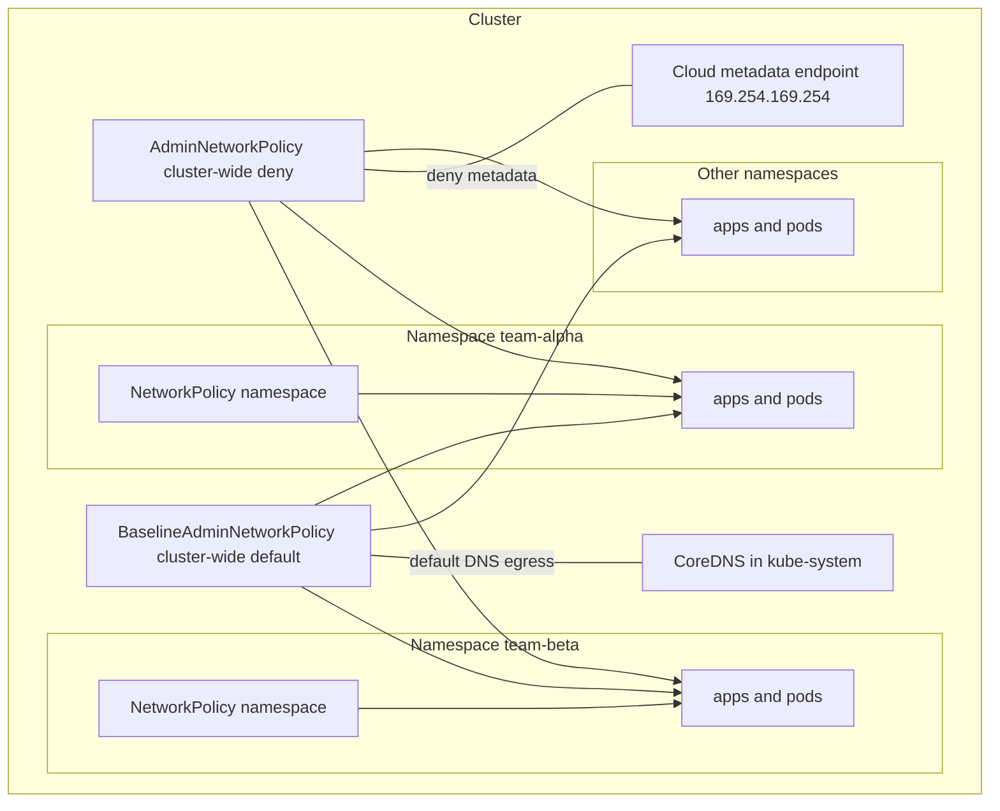

> Note for future use:
> This stage demonstrates cluster-wide guardrails using Calico GlobalNetworkPolicy
> on Calico v3.31.3. The upstream ANP CRDs were installed for learning purposes,
> but the cluster-level admin enforcement in this environment is implemented
> with Calico-native policy resources that are guaranteed to match the installed CNI.

# Not implemented in lab, only illustration and theory point of view. Actual implementation is done using calico "GlobalNetworkPolicy"

 # Optional Stage – AdminNetworkPolicy & BaselineAdminNetworkPolicy (Cluster-wide Guardrails)

This optional stage extends the lab beyond namespace-scoped `NetworkPolicy` to **cluster-wide admin guardrails**. It is designed for platform / security engineers and shows how to enforce non-overridable rules like “no pod anywhere can reach the cloud metadata service.” [web:285][web:295]

> Important: These APIs are provided by the Kubernetes Network Policy API project as CRDs and require CNI support. They are not part of the original `networking.k8s.io/v1` NetworkPolicy API. [web:296][web:278]

---

## 1. Why AdminNetworkPolicy and BaselineAdminNetworkPolicy?

Plain `NetworkPolicy` is **namespace-scoped**. App teams can create, change, or delete policies in their namespace, which is good for local control but problematic for cluster-wide security rules. [web:285][web:295]

Admin-tier APIs solve this:

- **AdminNetworkPolicy**: cluster-wide, non-overridable guardrails.
- **BaselineAdminNetworkPolicy**: cluster-wide default behavior that can be intentionally overridden by normal `NetworkPolicy`. [web:285][web:293][web:295]

Think of the precedence as:

- `AdminNetworkPolicy` > `NetworkPolicy` > `BaselineAdminNetworkPolicy`. [web:280][web:293]

Use cases:

- Deny cloud metadata access to all pods.
- Enforce a zero-trust baseline between tenants.
- Define default DNS or monitoring access that can be tightened by teams. [web:288][web:293][web:295]

---

## 2. CRDs and CNI Support

These resources come from the **Network Policy API CRDs**:

- `AdminNetworkPolicy` – `apiVersion: policy.networking.k8s.io/v1alpha1`
- `BaselineAdminNetworkPolicy` – `apiVersion: policy.networking.k8s.io/v1alpha1` [web:285][web:296]

You install them via:

```bash
kubectl apply -f https://github.com/kubernetes-sigs/network-policy-api/releases/latest/download/install.yaml
```

This makes the API server understand these new kinds, but **does not itself enforce traffic**. Enforcement depends on your CNI:

- Antrea: documents support for AdminNetworkPolicy and BaselineAdminNetworkPolicy when enabled in config (version requirements apply). [web:278]
- OVN-Kubernetes / OpenShift: documents AdminNetworkPolicy and BaselineAdminNetworkPolicy with explicit behavior and precedence. [web:286][web:291]
- Amazon EKS: offers enhanced network policy capabilities including an Admin tier and Baseline tier for clusters with supported versions and the Amazon VPC CNI. [web:279][web:281]

You must check:

1. The CRDs exist (e.g. `kubectl get crd | grep adminnetworkpolicy`). [web:296]
2. The CNI vendor documentation explicitly lists support for AdminNetworkPolicy/BaselineAdminNetworkPolicy. [web:278][web:286][web:279]

If there is no enforcement support, these objects will not affect traffic, even though `kubectl apply` succeeds. [web:296][web:278]

---

## 3. Conceptual Diagram – Where Admin Policies Fit

This diagram shows how AdminNetworkPolicy and BaselineAdminNetworkPolicy sit **above** namespace-level NetworkPolicy and affect multiple namespaces. [web:285][web:295]



Key idea:

- AdminNetworkPolicy applies **before** any namespace policy and cannot be overridden there.
- BaselineAdminNetworkPolicy applies **last** and can be overridden by namespace NetworkPolicy. [web:280][web:293][web:295]

---

------------------------------------------------------------------------------------------------------
# Optional Stage – Cluster-wide Guardrails

> Note for future use:
> This document explains the upstream AdminNetworkPolicy / BaselineAdminNetworkPolicy
> concept for future reference.
>
> In this lab environment, the runnable cluster-wide admin-stage implementation
> is done using Calico GlobalNetworkPolicy on Calico v3.31.3, because that is
> the policy API exposed and working in the current cluster.

This optional stage extends the lab beyond namespace-scoped `NetworkPolicy`
to cluster-wide admin guardrails.

The goal is to understand two things:

- the upstream Kubernetes AdminNetworkPolicy concept.
- the working cluster-wide implementation used in this lab with Calico.

---

## 1. Why cluster-wide guardrails?

Plain `NetworkPolicy` is namespace-scoped. That is good for app teams, but it is
not enough for platform-level security controls.

Cluster-wide guardrails are useful when you want to:

- block traffic that should never be allowed cluster-wide.
- enforce tenant isolation across namespaces.
- apply a security baseline that is consistent for the entire cluster.

---

## 2. Upstream ANP and BANP

The upstream Kubernetes Network Policy API introduces:

- `AdminNetworkPolicy`
- `BaselineAdminNetworkPolicy`

These are cluster-scoped APIs intended for platform administrators.

Conceptually:

- `AdminNetworkPolicy` = non-overridable guardrails.
- `BaselineAdminNetworkPolicy` = default connectivity that app teams can refine.

The precedence model is:

- `AdminNetworkPolicy` > `NetworkPolicy` > `BaselineAdminNetworkPolicy`

These APIs are useful for future/reference learning, but in this lab environment
the runnable admin-stage example is implemented with Calico.

---

## 3. Why Calico is used in this lab

This cluster is running Calico v3.31.3 and exposes Calico policy resources.

The working cluster-wide admin-stage in this repository is therefore implemented
with Calico `GlobalNetworkPolicy`.

That keeps the lab practical, reproducible, and aligned with the actual CNI in
the cluster.

---

## 4. Calico cluster-wide examples

This lab includes two Calico GlobalNetworkPolicy examples:

- `deny-alpha-external-egress.yaml`
- `deny-alpha-to-beta.yaml`

These demonstrate cluster-wide guardrails for:

- blocking external egress from `team-alpha`.
- blocking traffic from `team-alpha` to `team-beta` on TCP 5678.

---

## 5. Files used

Working Calico files:

- `resources/calico-global-netpol/deny-alpha-external-egress.yaml`
- `resources/calico-global-netpol/deny-alpha-to-beta.yaml`

Reference upstream ANP files kept for future learning only:

- `resources/admin-netpol/...` if retained in the repo for reference

---

## 6. Make targets

Working Calico targets:

```bash
make -f Makefile_NetworkPolicy calico-admin-apply-deny-alpha-external-egress
make -f Makefile_NetworkPolicy calico-admin-test-deny-alpha-external-egress
make -f Makefile_NetworkPolicy calico-admin-apply-deny-alpha-to-beta
make -f Makefile_NetworkPolicy calico-admin-test-deny-alpha-to-beta
make -f Makefile_NetworkPolicy calico-admin-cleanup
```

Optional upstream ANP targets may be kept for future reference, but they are not
the primary runnable flow in this environment.

---

## 7. Expected behavior

After applying the Calico policies:

- `alpha-client -> example.com` should be blocked.
- `alpha-client -> beta-server:5678` should be blocked.
- `beta-client -> beta-server:5678` should still work.

---

## 8. When to use this stage

Use this stage when you want to show:

- the difference between namespace-scoped and cluster-scoped policy.
- how platform guardrails work in Kubernetes networking.
- how Calico can enforce cluster-wide controls in a practical lab.

---

## 9. Summary

This repository contains two ideas:

- upstream ANP/BANP for future reference and conceptual learning.
- Calico GlobalNetworkPolicy for the working admin-stage lab in this cluster.

That separation keeps the lab practical today while leaving room to revisit
upstream ANP later if the cluster/CNI support changes.