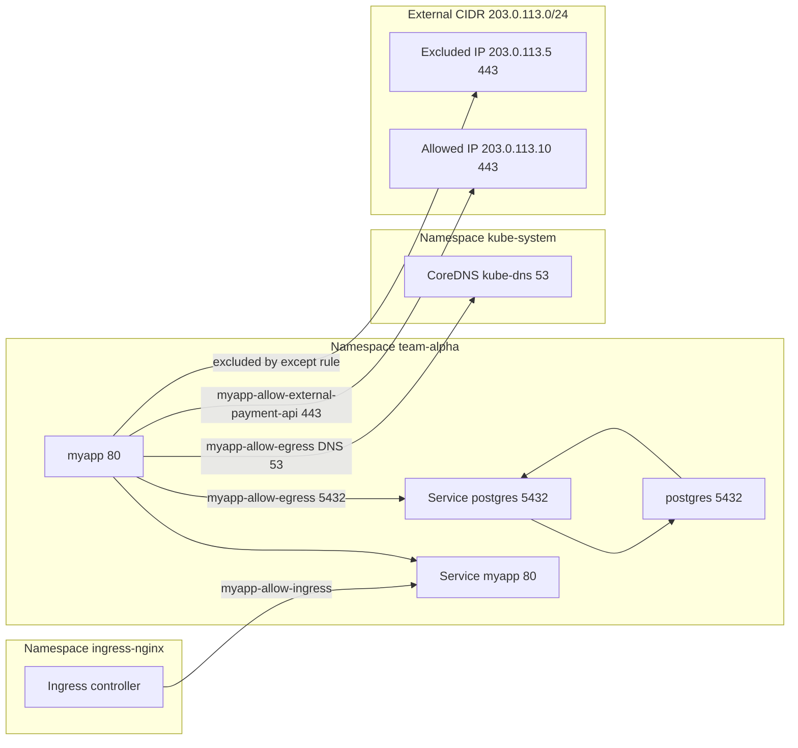

# NetworkPolicies: Default Deny & Least-Privilege (myapp ↔ postgres ↔ external API)

This lab shows how to secure a Kubernetes namespace using NetworkPolicies by:

1. Allowing only the minimum traffic required between:
   - An external payment API over HTTPS using `ipBlock`. [web:237][web:236][web:245]
---

## Components
Namespace: `team-alpha` (primary lab namespace). [web:236][web:261]

- Pods:
  - `myapp` – simple web application running in `team-alpha`, listening on `80/TCP`.
  - `postgres` – PostgreSQL pod (`postgres:16-alpine`) in `team-alpha`, listening on `5432/TCP`. [web:232][web:275]

- Services:
  - `myapp` – ClusterIP Service in `team-alpha`, port `80/TCP`, targets `myapp` pods.
  - `postgres` – ClusterIP Service in `team-alpha`, port `5432/TCP`, selector `app=postgres`. [web:237][web:235]

- Other namespaces and components:
  - `ingress-nginx` – Ingress controller (`ingress-nginx-controller` Deployment) that routes external HTTP into `myapp`. [web:248][web:261]
  - `kube-system` – CoreDNS (`kube-dns` pods), providing cluster DNS on `UDP/TCP 53`. [web:275][web:236]

- External (for ipBlock egress pattern):
  - Example payment API CIDR: `203.0.113.0/24`, with a single IP `203.0.113.5/32` excluded. This is a documentation CIDR used to demonstrate `ipBlock`. [web:274][web:260]

---
## External payment API egress (ipBlock)
File:
- `resources/netpol/myapp/myapp-allow-external-payment-api.yaml`

Example:

```yaml
apiVersion: networking.k8s.io/v1
kind: NetworkPolicy
metadata:
  name: myapp-allow-external-payment-api
  namespace: team-alpha
spec:
  podSelector:
    matchLabels:
      app: myapp
  policyTypes:
    - Egress
  egress:
    - to:
        - ipBlock:
            cidr: 203.0.113.0/24        # Example external payment API CIDR
            except:
              - 203.0.113.5/32          # Excluded IP for demonstration
      ports:
        - protocol: TCP
          port: 443
```

What it does:

- Allows `myapp` pods in `team-alpha` to:
  - Connect to IPs in `203.0.113.0/24` on `443/TCP`.
  - Block `203.0.113.5/32` specifically, even though it sits inside that CIDR. [web:247][web:260][web:277]
- Demonstrates `ipBlock` usage for external APIs and webhooks where you control outbound IP ranges. [web:256][web:274]

Operational note: `ipBlock` rules need maintenance when external IP ranges change (e.g. payment provider updates). They do not automatically follow DNS or label changes. [web:256][web:260]

---

## 6. Final traffic model (least privilege)

With all policies applied:

- **Ingress to myapp**:
  - Allowed: from `ingress-nginx` namespace on `80/TCP`.
  - Denied: from other namespaces/pods. [web:237][web:248]

- **Egress from myapp**:
  - Allowed:
    - To Postgres pods (`app=postgres`) on `5432/TCP`.
    - To CoreDNS in `kube-system` on `UDP/TCP 53` for DNS.
    - To external payment API CIDR (`203.0.113.0/24` except `203.0.113.5`) on `443/TCP`. [web:236][web:275]
  - Denied:
    - Any other external IPs/ports not covered by the above rules.

- **Ingress to postgres**:
  - Allowed: from `myapp` (`app=myapp`) on `5432/TCP`.
  - Denied: everything else. [web:237][web:251]

- **Namespace baseline**:
  - `team-alpha-default-deny-all` ensures all traffic requires explicit allow rules. [web:236][web:245][web:261]

This implements the classic **default-deny + least-privilege** pattern recommended in NetworkPolicy best practices. [web:245][web:275]

---

## 7. Component diagram (Mermaid)

This diagram shows the pods, services, DNS, ingress controller, and external payment CIDR with annotations of which NetworkPolicy enables each path. [web:236][web:261]



---

## 8. Playbook: step-by-step commands (Makefile-driven)

The lab includes a guided playbook driven by the top-level `Makefile`. Key targets: [web:261][web:236]

### 8.1 Run myapp + least-privilege playbook

From repo root:

```bash
make run-myapp-least-privilege-playbook
```

This executes steps:

1. **Setup & baseline**:
   - Ensure Minikube and CNI support NetworkPolicy.
   - Cleanup previous namespaces/resources.
   - Apply `team-alpha` and `team-beta` namespaces.
   - Apply baseline server/client pods and test open connectivity (no policies). [web:261][web:236]

2. **Install workloads**:
   - Install `myapp` via Helm into `team-alpha`.
   - Install dummy Postgres into `team-alpha`.
   - Debug environment: verify ingress controller, myapp Service/pods, Postgres Service/pods, endpoints. [web:248][web:232]

3. **Apply default-deny**:
   - Apply `team-alpha-default-deny-all` (Ingress + Egress).
   - All traffic is now blocked by default. [web:236][web:245]

4. **Apply myapp-specific policies**:
   - `apply-myapp-netpol`:
     - `myapp-allow-ingress.yaml` (ingress-nginx → myapp:80).
     - `myapp-allow-egress.yaml` (myapp → postgres:5432 + DNS).  
     - `myapp-allow-postgres-ingress.yaml` (myapp → postgres:5432 ingress). [web:237][web:251]
   - `apply-myapp-allow-external-payment-api.yaml`:
     - `myapp-allow-external-payment-api.yaml` (myapp → external CIDR:443). [web:247][web:256]


5. **Test external payment API egress**:
   - `create-myapp-debug`:
     - Creates `myapp-debug` pod (`nicolaka/netshoot`, label `app=myapp`), so myapp policies apply. [web:261][web:253]
   - `test-myapp-external-api-egress`:
     - From `myapp-debug`, attempts TCP connect:
       - To `203.0.113.10:443` → allowed by CIDR (even if endpoint not listening).
       - To `203.0.113.5:443` → blocked or timed out (excluded IP). [web:247][web:260]
   - `delete-myapp-debug`: cleans up the debug pod after testing.

All steps print coloured messages and “Press ENTER” prompts to make it easy to follow the flow interactively.

---

## 9. How to reuse this playbook later

To rerun the full scenario:

```bash
# Ensure Minikube and CNI are set up
make setup-minikube

# Run the guided myapp + NetworkPolicy scenario
make run-myapp-least-privilege-playbook
```
