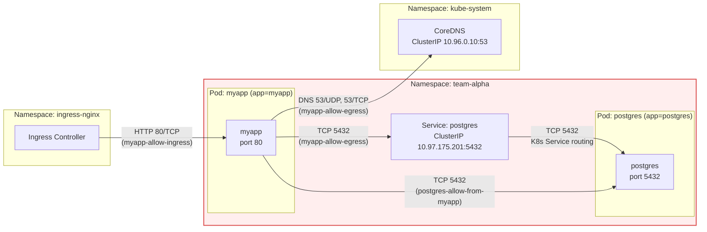

# NetworkPolicies: Default Deny & Least-Privilege (myapp ↔ postgres)

This lab demonstrates how to secure traffic in a Kubernetes namespace using NetworkPolicies:  
1. Start from a **default-deny** baseline.  
2. Then explicitly allow only the minimum traffic needed (least privilege) between `myapp`, `postgres`, `ingress-nginx`, and DNS.

## Components

- Namespace: `team-alpha`.
- Pods:
  - `myapp` – simple web application.
  - `postgres` – PostgreSQL `postgres:16-alpine` container, listening on `5432/TCP`. [web:232][web:248]
- Services:
  - `postgres` – ClusterIP service on `5432/TCP`, selecting pods with `app=postgres`. [web:237][web:235]
- Other:
  - `ingress-nginx` – Ingress controller in `ingress-nginx` namespace.
  - CoreDNS – DNS service in `kube-system` namespace (ClusterIP `10.96.0.10` in this lab). [web:237][web:251]

---

## Component diagram (Mermaid)

You can embed this diagram into the README or a separate `.md` file. GitHub and many Markdown viewers render Mermaid directly. [web:248][web:250]



This diagram shows:

- Namespaces: `team-alpha`, `ingress-nginx`, `kube-system`.
- Pods: `myapp`, `postgres`.
- Service: `postgres` ClusterIP.
- DNS: CoreDNS.
- Arrows annotated with which NetworkPolicy allows the traffic. [web:237][web:248]

---

## 1. Default-deny baseline for the namespace

File: `resources/netpol/team-alpha/team-alpha-default-deny-all.yaml` (name may vary).

```yaml
apiVersion: networking.k8s.io/v1
kind: NetworkPolicy
metadata:
  name: team-alpha-default-deny-all
  namespace: team-alpha
spec:
  podSelector: {}        # selects ALL pods in team-alpha
  policyTypes:
    - Ingress
    - Egress
```
**What this does**

- All pods in `team-alpha` are now isolated for both ingress and egress. [web:236][web:239]
- No traffic in, no traffic out, until additional policies explicitly allow it.
- After applying this:
- `myapp` cannot reach Postgres.
- `myapp` cannot perform DNS lookups (e.g. `nslookup postgres.team-alpha.svc.cluster.local` times out). [web:241][web:243]

This is the recommended starting point for secure clusters: default-deny everywhere, then open only what you need. [web:245][web:249]

---

## 2. Allow ingress to myapp from ingress-nginx

File: `resources/netpol/myapp/myapp-allow-ingress.yaml`.

```yaml
apiVersion: networking.k8s.io/v1
kind: NetworkPolicy
metadata:
  name: myapp-allow-ingress
  namespace: team-alpha
spec:
  podSelector:
    matchLabels:
      app: myapp
  policyTypes:
    - Ingress
  ingress:
    - from:
        - namespaceSelector:
            matchLabels:
              kubernetes.io/metadata.name: ingress-nginx
      ports:
        - protocol: TCP
          port: 80
```

**What this does**

- Allows HTTP traffic **to** `myapp` pods on port 80.
- Only from pods in the `ingress-nginx` namespace (the Ingress controller). [web:246][web:248]
- All other ingress to `myapp` remains blocked by the default-deny policy.

---
## 3. Allow egress from myapp to Postgres

File: `resources/netpol/myapp/myapp-allow-egress.yaml` (initial version).

```yaml
apiVersion: networking.k8s.io/v1
kind: NetworkPolicy
metadata:
  name: myapp-allow-egress
  namespace: team-alpha
spec:
  podSelector:
    matchLabels:
      app: myapp
  policyTypes:
    - Egress
  egress:
    - to:
        - podSelector:
            matchLabels:
              app: postgres
      ports:
        - protocol: TCP
          port: 5432
```

**What this does**

- Allows `myapp` pods to initiate TCP connections on port 5432 to pods labeled `app=postgres`. [web:246][web:248]
- Everything else (other destinations, other ports) is still denied by the default-deny.

**Observed behavior at this stage**

- DNS is still blocked (no egress to DNS), so:
  - `nslookup postgres.team-alpha.svc.cluster.local` from `myapp` fails.
  - `nc -vz postgres.team-alpha.svc.cluster.local 5432` reports “bad address”. [web:241][web:243]
- Lesson: with default-deny egress, you must explicitly allow DNS traffic; otherwise service names will not resolve. [web:246][web:251]

---
## 4. Add DNS egress for myapp

We updated `myapp-allow-egress.yaml` to also allow DNS traffic to CoreDNS in the `kube-system` namespace. [web:241][web:251]

```yaml
apiVersion: networking.k8s.io/v1
kind: NetworkPolicy
metadata:
  name: myapp-allow-egress
  namespace: team-alpha
spec:
  podSelector:
    matchLabels:
      app: myapp
  policyTypes:
    - Egress
  egress:
    # 1) Allow egress to Postgres on 5432
    - to:
        - podSelector:
            matchLabels:
              app: postgres
      ports:
        - protocol: TCP
          port: 5432

    # 2) Allow egress to DNS (CoreDNS in kube-system)
    - to:
        - namespaceSelector:
            matchLabels:
              kubernetes.io/metadata.name: kube-system
      ports:
        - protocol: UDP
          port: 53
        - protocol: TCP
          port: 53
```

**What this does**

- Keeps the Postgres egress path.
- Adds DNS egress so `myapp` can talk to CoreDNS on UDP/TCP port 53. [web:241][web:248][web:251]

**Observed behavior after this change**

From inside `myapp` pod:

- `nslookup postgres.team-alpha.svc.cluster.local` succeeds and returns:
  - DNS server: `10.96.0.10:53`.
  - Name: `postgres.team-alpha.svc.cluster.local`.
  - Address: `10.97.175.201` (ClusterIP of the `postgres` service). [web:237][web:251]
- However, `nc -vz postgres.team-alpha.svc.cluster.local 5432` still times out.  
  DNS is now working, but the TCP path to Postgres is blocked on the **ingress** side. [web:232][web:246]

---
## 5. Verify Postgres service and endpoints

We confirmed that the problem was not misconfiguration of the Service, but NetworkPolicy. [web:237][web:235]

Checks:

```bash
kubectl get pod -n team-alpha -l app=postgres --show-labels
kubectl get svc postgres -n team-alpha -o yaml
kubectl get endpoints postgres -n team-alpha -o wide
kubectl describe pod -n team-alpha -l app=postgres
```

Findings:

- Postgres pod:
  - `app=postgres`, `Ready = True`, container port `5432/TCP`.  
- Service `postgres`:
  - Selects pods with `app=postgres`, exposes port `5432/TCP`.  
- Endpoints:
  - `postgres   10.244.120.68:5432`. [web:232][web:251]

Conclusion: Service and pod are wired correctly, but connections are dropped by NetworkPolicy at the Postgres side (default-deny ingress). [web:237][web:246]

---
## 6. Allow ingress to Postgres from myapp

We added a dedicated Postgres ingress policy:

File: `resources/netpol/postgres/postgres-allow-from-myapp.yaml`.

```yaml
apiVersion: networking.k8s.io/v1
kind: NetworkPolicy
metadata:
  name: postgres-allow-from-myapp
  namespace: team-alpha
spec:
  podSelector:
    matchLabels:
      app: postgres
  policyTypes:
    - Ingress
  ingress:
    - from:
        - podSelector:
            matchLabels:
              app: myapp
      ports:
        - protocol: TCP
          port: 5432
```

**What this does**

- Selects the Postgres pods (`app=postgres`).
- Allows incoming TCP connections on port 5432, but **only** from pods labeled `app=myapp` in the same namespace. [web:246][web:252]
- All other ingress to Postgres remains denied by the default-deny baseline.

**Observed behavior after this change**

From inside `myapp` pod:

```bash
# DNS check
nslookup postgres.team-alpha.svc.cluster.local

# TCP connectivity check
nc -vz postgres.team-alpha.svc.cluster.local 5432
```

- DNS resolution works (service name resolves to ClusterIP). [web:237][web:251]
- TCP connect on 5432 succeeds (no more timeout), meaning Postgres is reachable under the least-privilege rule set. [web:232][web:246]

---
## Final traffic model (least privilege)

With all policies applied, the effective traffic matrix in `team-alpha` is:

- **Ingress to myapp**
  - Allowed:
    - From `ingress-nginx` namespace on `80/TCP`.
  - Denied:
    - Everything else. [web:246][web:248]

- **Egress from myapp**
  - Allowed:
    - To Postgres pods (`app=postgres`) on `5432/TCP`.
    - To CoreDNS in `kube-system` on UDP/TCP `53` for DNS. [web:241][web:251]
  - Denied:
    - Any other destination, any other port.

- **Ingress to postgres**
  - Allowed:
    - From `myapp` pods (`app=myapp`) on `5432/TCP`. [web:246][web:252]
  - Denied:
    - Any other source.

- **Namespace baseline (`team-alpha-default-deny-all`)**
  - All pods are isolated by default for ingress and egress; only the above explicit rules open traffic. [web:236][web:239]

This implements a clean **least-privilege** design: every allowed path is intentional and described in YAML; everything else is blocked. [web:241][web:245][web:249]

---

