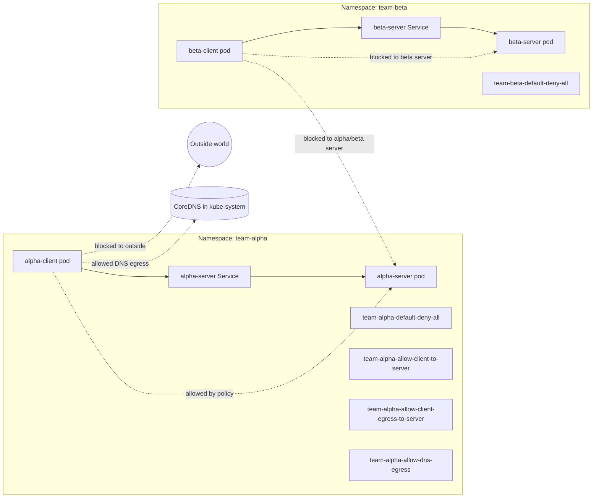
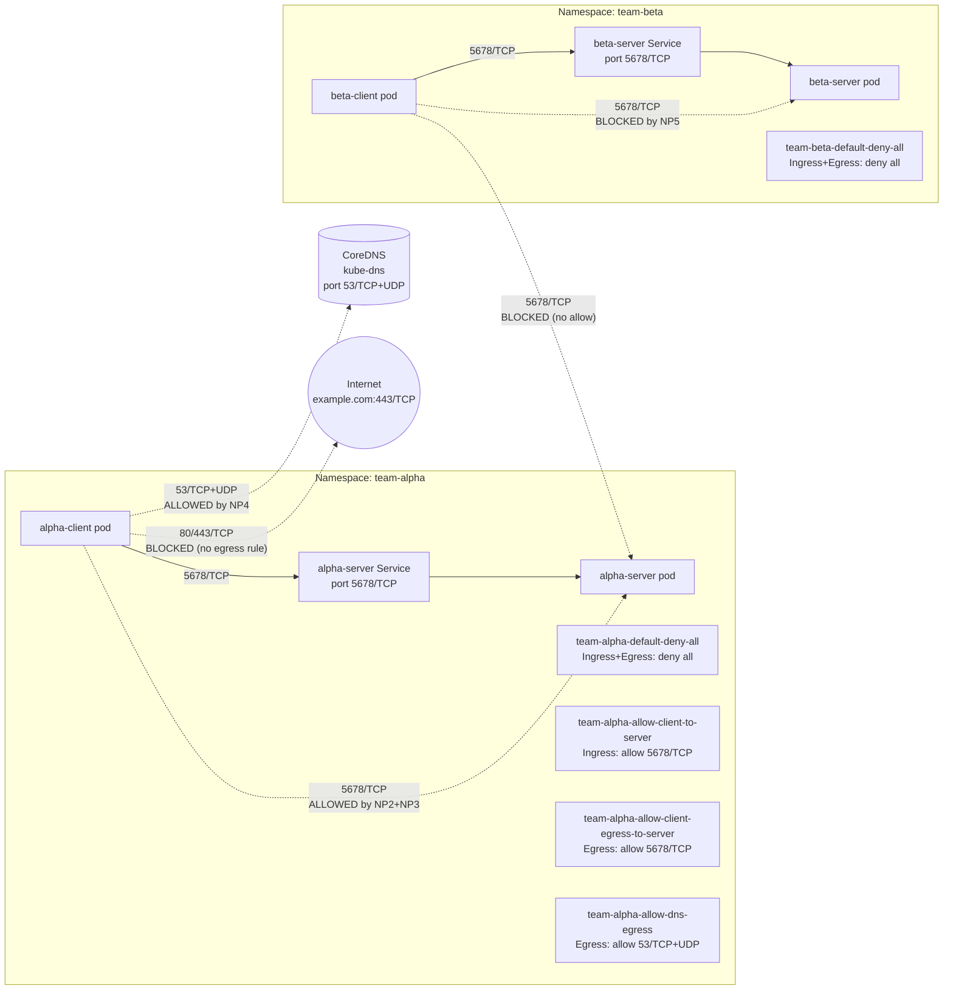

# Basic NetworkPolicy Exercise

## Big Picture
- This lab has two namespaces: 
    1. team-alpha and 
    2. team-beta
- Each namespace has a client pod and a server pod, and the server is exposed inside the namespace through a Service. 
- By default, Kubernetes allows pod-to-pod traffic, then your NetworkPolicies progressively change that to default-deny and finally to 
  least-privilege. 
- Kubernetes NetworkPolicies control traffic flow at the pod level, and a pod becomes isolated for ingress or egress once a policy selects it  
  for that direction.

### Simple way to remember it
    1. Ingress = traffic entering a pod.
    2. Egress = traffic leaving a pod.
    3. Default-deny = block everything first.
    4. Least-privilege = allow only the exact flow you need.

## Component Diagram and NetworkPolicy

---
### What ingress and egress mean
    Ingress means traffic coming into a pod. For example, alpha-client connecting to alpha-server is ingress for alpha-server. When a pod is isolated for ingress, only traffic explicitly allowed by an ingress policy can reach it.

    Egress means traffic going out of a pod. For example, alpha-client calling alpha-server, or a pod looking up DNS, is egress from the client pod. When a pod is isolated for egress, only traffic explicitly allowed by an egress policy can leave it.

## Component diagram with ports
This diagram shows who can talk to whom, on which port, and under which policies.

---

## What each netpol file does

| File                                          | Purpose                                          | Main effect                               |
| --------------------------------------------- | ------------------------------------------------ |-------------------------------------------| 
| team-alpha-default-deny-all.yaml              | Default-deny for namespace team-alpha.           | Blocks all ingress and egress for elected |   
|                                               |                                                  | pods unless another policy allows it.     |  
|                                               |                                                  | kubernetes                                |
|-----------------------------------------------|--------------------------------------------------|-------------------------------------------|
| team-beta-default-deny-all.yaml               | Default-deny for namespace team-beta.            |Blocks all ingress and egress for beta pods| 
|                                               |                                                  |unless allowed. Kubernetes                 |
|-----------------------------------------------|--------------------------------------------------|-------------------------------------------|
| team-alpha-allow-client-to-server.yaml        | Allow ingress to alpha-server from alpha-client. |Lets alpha-client reach alpha-server on TCP| 
|                                               |                                                  |5678. kubernetes                           |
|-----------------------------------------------|--------------------------------------------------|-------------------------------------------|
| team-alpha-allow-client-egress-to-server.yaml | Allow egress from alpha-client to alpha-server.  |Lets alpha-client send traffic to          |
|                                               |                                                  |alpha-server on TCP 5678. kubernetes       |
|-----------------------------------------------|--------------------------------------------------|-------------------------------------------|
| team-alpha-allow-dns-egress.yaml              | Allow DNS egress from alpha pods.                |Lets alpha pods query CoreDNS on           |
|                                               |                                                  | TCP/UDP 53. kubernetes+1                  |
|-----------------------------------------------|--------------------------------------------------|-------------------------------------------|

### Allowed vs blocked
1. team-alpha-default-deny-all.yaml

    Namespace: team-alpha.

    podSelector: {} and policyTypes: [Ingress, Egress].

    **Effect**: every alpha pod is isolated; all ports (including 5678 and 53) are blocked until allowed.

2. team-beta-default-deny-all.yaml

    Namespace: team-beta.

    Same pattern; beta pods are fully isolated.

3. team-alpha-allow-client-to-server.yaml

    Namespace: team-alpha.

    podSelector selects alpha-server (app=server,team=alpha).

    policyTypes: [Ingress].

    ingress.from selects alpha-client (app=client,team=alpha).

    ports: 5678/TCP.

    **Effect**: alpha-client can send ingress traffic to alpha-server on port 5678/TCP; other pods or ports remain blocked.

4. team-alpha-allow-client-egress-to-server.yaml

    Namespace: team-alpha.

    podSelector selects alpha-client.

    policyTypes: [Egress].

    egress.to selects alpha-server.

    ports: 5678/TCP.

    **Effect**: alpha-client can send egress traffic to alpha-server on 5678/TCP; egress to other pods or ports is still blocked.

5. team-alpha-allow-dns-egress.yaml

    Namespace: team-alpha.

    podSelector: {} (all alpha pods).

    policyTypes: [Egress].

    egress.to selects CoreDNS pods in kube-system with k8s-app=kube-dns.

    ports: 53/TCP and 53/UDP.

    **Effect**: alpha pods can send DNS traffic to CoreDNS on port 53 but still cannot talk to arbitrary external IPs or ports.

Together, these policies implement default-deny, then carve out only:

    alpha-client → alpha-server:5678/TCP

    alpha pods → CoreDNS:53/TCP+UDP

## Connectivity tests
Your tests are basically proving the policy stages step by step:
1. Baseline test
    No NetworkPolicies yet. All curls should succeed. This shows the cluster is open by default.
    
    alpha-client → alpha-server:5678/TCP: allowed.

    beta-client → beta-server:5678/TCP: allowed.

    beta-client → alpha-server:5678/TCP (cross-namespace): allowed.

    Shows the default “allow all” Kubernetes behavior.

2. Default-deny test
    After applying only the two deny-all policies, all curls should fail or time out. This proves isolation is working.

    team-alpha-default-deny-all + team-beta-default-deny-all applied.

    All three curls on port 5678/TCP fail or time out.

    Demonstrates that once pods are selected by a deny-all ingress+egress policy, no traffic is allowed until you add explicit allow rules

3. Least-privilege test
    After adding the alpha allow policies, only alpha-client -> alpha-server should succeed. Beta flows should still fail. This proves you allowed only one intended path.

    team-alpha-allow-client-to-server and team-alpha-allow-client-egress-to-server applied, plus team-alpha-allow-dns-egress.

    alpha-client → alpha-server:5678/TCP: succeeds and prints hello-from-alpha-server.

    beta-client → beta-server:5678/TCP: still blocked.

    beta-client → alpha-server:5678/TCP: still blocked.

    Shows that only the single intended path (alpha client → alpha server on 5678) is restored; everything else stays denied.

4. DNS test
    This checks whether alpha pods can still resolve names after egress is restricted. If DNS policy is correct, internal name lookups should work. External HTTPS still fails unless you explicitly allow outbound web traffic.

    alpha-client resolves alpha-server.team-alpha.svc.cluster.local via CoreDNS on port 53, thanks to team-alpha-allow-dns-egress.

    External curl https://example.com:443 still times out, because you have not allowed egress to arbitrary IPs/ports; default-deny egress is still in effect.

## Simple playbook target for the Makefile

.PHONY: run-networkpolicy-default-deny-playbook
run-networkpolicy-default-deny-playbook: ## Full guided playbook: default-deny + least-privilege
	@printf '$(YELLOW)%s$(RESET)\n' "Step 0. Check CNI and cleanup previous run..."
	$(MAKE) check-netpol-support
	$(MAKE) cleanup

	@printf '$(YELLOW)%s$(RESET)\n' "Step 1. Apply namespaces team-alpha and team-beta..."
	$(MAKE) apply-namespaces

	@printf '$(YELLOW)%s$(RESET)\n' "Step 2. Apply pods and wait until Ready..."
	$(MAKE) apply-pods

	@printf '$(YELLOW)%s$(RESET)\n' "Step 3. Baseline connectivity (no NetworkPolicy; expect ALLOWED)..."
	$(MAKE) test-baseline-connectivity

	@printf '$(YELLOW)%s$(RESET)\n' "Step 4. Apply default-deny in both namespaces..."
	$(MAKE) apply-default-deny

	@printf '$(YELLOW)%s$(RESET)\n' "Step 5. Connectivity under default-deny (expect BLOCKED)..."
	$(MAKE) test-default-deny-connectivity

	@printf '$(YELLOW)%s$(RESET)\n' "Step 6. Apply least-privilege policies in team-alpha..."
	$(MAKE) apply-least-privilege

	@printf '$(YELLOW)%s$(RESET)\n' "Step 7. Connectivity under least-privilege (alpha allowed, beta blocked)..."
	$(MAKE) test-least-privilege-connectivity

	@printf '$(YELLOW)%s$(RESET)\n' "Step 8. Optional DNS connectivity test from team-alpha..."
	$(MAKE) test-dns-connectivity

This target just orchestrates your existing phony targets in the right order, so make run-networkpolicy-default-deny-playbook gives the full story:
   1. Set up cluster + namespaces + pods.

   2. Show “everything open” baseline.

   3. Apply default-deny and prove everything is blocked.

   4. Apply least-privilege rules and prove only the intended path on port 5678 and DNS on port 53 are allowed